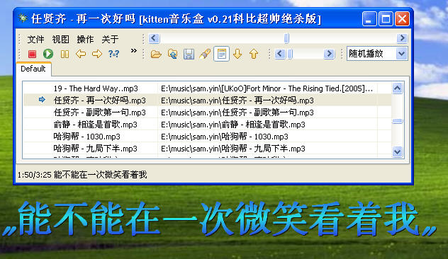
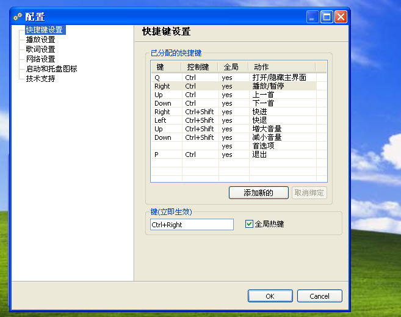
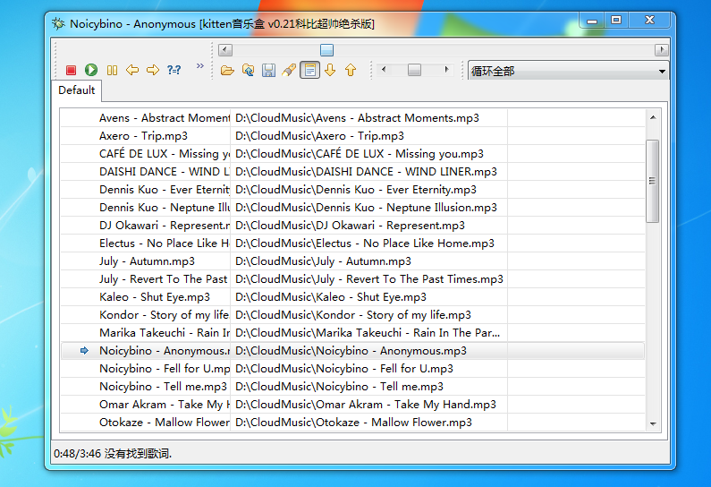

KittenBox Music Player
===

An swt/jface mp3 player written in 2009.

## Notes
调节系统音量依赖的库没有64位版本, 2017新增VolumeManager不使用那个依赖的库.
see https://github.com/cnfree/SWT-Win32-Extension/issues/2

## Born
2009年8月14日晚，周五。今晚没有PLU星际争霸的比赛。从06年开始看PLU以来，年年都不会错过，GF也在我的怂恿下学会了打星际，水平也有一定的长进，并成长成为一名忠实的浩方型选手。

没有比赛的日子，总是很难过。这半个月以来除了上班，也没有再做什么小玩艺儿。开始郁闷了。做一个播放器吧！

于是Kitten Box诞生了！

我发现Windows编程能做的东西，SWT都能做，　访问注册表，　硬盘，　拖拽，窗口悬停，　透明，　闪动，　钩子，　Office/Vista风格的皮肤。 Jesus Christ!

## Dev Logs
**2017年8月11日 V0.3:**

64位系统支持(升级swt, mp3, jintellitype ...)

**2010年1月9日 V0.2(科比3绝杀版):**
1. 歌词在状态栏同步显示
2. 首选项>歌词设置
3. 首选项>网络设置(设置代理服务器)
4. 关联歌词,提供本地搜索，用户可自己关联歌词文件.
5. 在线搜索,从网络上搜索歌词并下载
   （盗用了百度的mp3搜索，下载LRC歌词极其方便）.
6. 调整歌词偏移量(7种调整方式)(在工具栏增加"歌词慢了!","歌词快了!"两个按钮,
  方便实时调整，会实时保存偏移量到歌词文件)
7. 自动识别歌词文件的编码方式.拒绝乱码.

其它更新:
1. 一键恢复工具栏到默认布局，同时恢复窗口到默认大小
2. 现在除了自动保存工具栏布局外，也会自动保存窗口大小和位置。
3. 所依赖的SWT,JFace升级到最新的3.5版

**2009年9月**

系统全局热键设置完成

**2009年8月23日 V0.1(科比生日1978.8.23快乐版)**
1. 工具栏折行，右键锁定工具栏
2. 新增音量控制
3. 新增操作播放列表的工具栏
4. 播放列表拖拽
5. 新增播放顺序选择下拉框
6. 退出时自动保存工具栏布局，音量，播放顺序等参数
7. 优化了进度条的拖动，可平滑拖动以控制播放进度

更多logs见docs目录.

## References
以后备用, 当时写的时候这些文章还没有出现.

1. http://www.cnblogs.com/wulm/p/6930807.html

